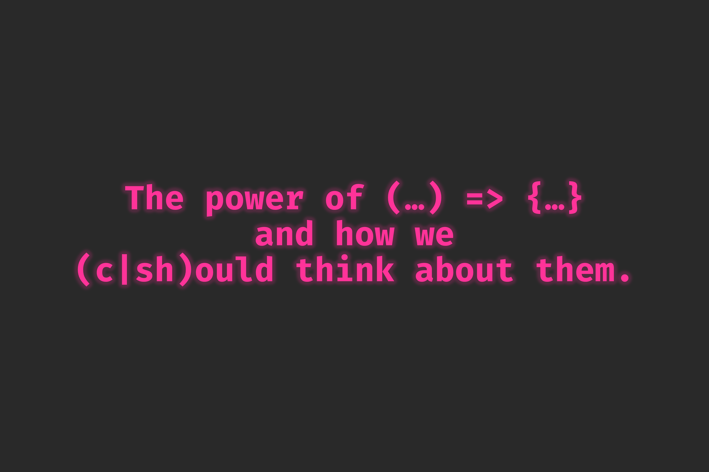

<h1 align="center">The Power of Functions</h1>

  The power of functions and how we (c|sh)ould think about them.

 

> Materials for my talk about Getters and Setters, how to reason about functions and why purity makes things so much easier.

## Used VS Code Plugins
Because some people asked me after the talk which plugins I use: [Vim](https://marketplace.visualstudio.com/items?itemName=vscodevim.vim) and [Code Runner](https://marketplace.visualstudio.com/items?itemName=formulahendry.code-runner).
You can get the relative line numbers using `editor.lineNumbers: "relative"` and this is mainly used for easier navigation using the vi bindings.

## Slides
The slides are available under [`./slides`](./slides).

## Presentations
- *12.02.2019:* [stahlstadt.js // un-meetup Feb.2019Stahlstadt.js #24](https://www.meetup.com/stahlstadt-js/events/268136639/) [:movie_camera:](asap)
